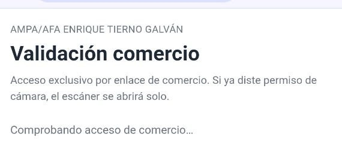
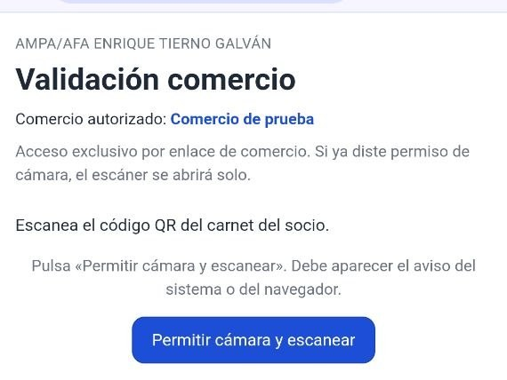
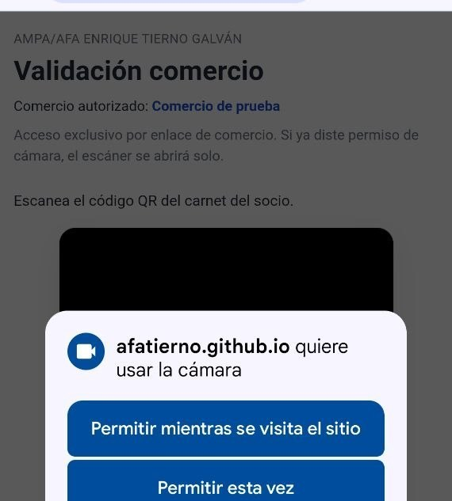
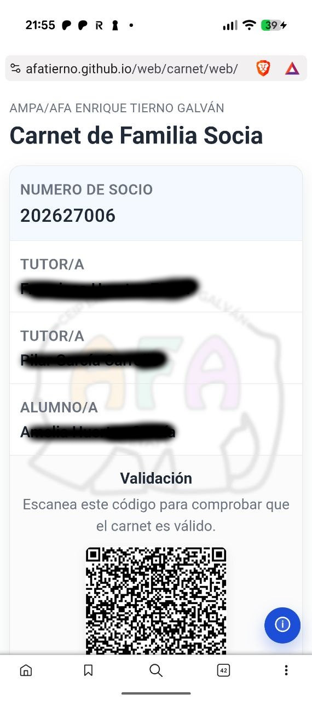
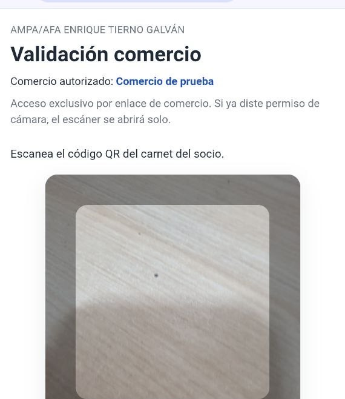
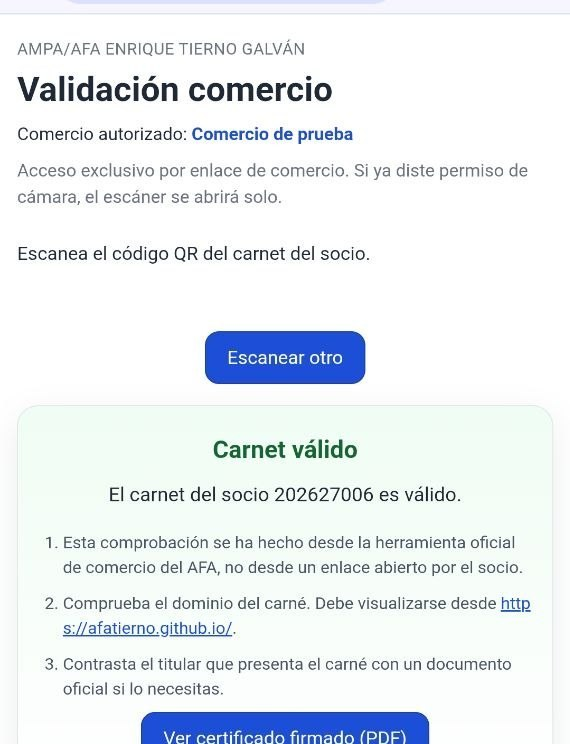
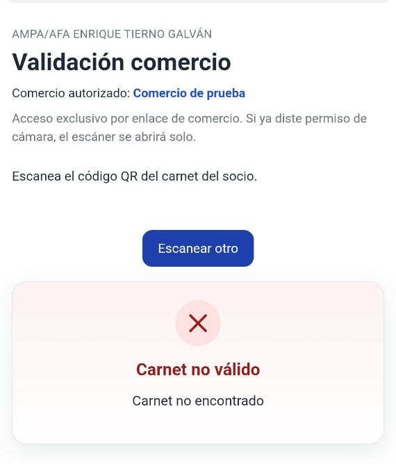

# Guía de validación de carnets para comercios

Esta guía explica cómo comprobar si un carnet del AFA Enrique Tierno Galván es válido, usando la herramienta oficial del AMPA/AFA.

No hace falta instalar ninguna aplicación: solo un móvil o tablet con cámara y el enlace personal de tu comercio.

---

## Guía rápida

1. Abrid **vuestro enlace personal** (el que os facilitó el AFA).
2. Permitid la **cámara** si el móvil lo pide.
3. Pedid al socio que muestre el **QR de su carnet** (reciente).
4. Leed el resultado: **válido** → aplicar ventaja; **no válido** → no aplicar y, si hace falta, contactar con el AFA.

---

## Guía completa

### 1. Tu enlace personal

Cada comercio tiene **un enlace único** que os facilitará el AFA.  
Ese enlace es solo para vuestro establecimiento: **no lo compartáis** con otros comercios ni lo publiquéis en internet.

Guardad ese enlace donde lo tengáis a mano en caja (WhatsApp interno, nota en el mostrador, acceso directo en el móvil del local, etc.).

---

### 2. Abrir la herramienta

1. Abrid el enlace en el **móvil o tablet** del comercio.
2. Deberíais ver **«Validación comercio»** y vuestro nombre en **«Comercio autorizado: …»**.

Si no aparece el nombre del comercio, o sale un mensaje de error, **no uséis la herramienta** y contactad con el AFA.

---

### 3. Permitir el uso de la cámara

La primera vez, el navegador pedirá permiso para usar la cámara.

1. Pulsad **«Permitir cámara y escanear»** (botón azul).
2. Cuando el móvil lo pida, elegid **Permitir**.

Si ya disteis permiso antes, el escáner puede abrirse solo al entrar.

---

### 4. Escanear el QR del carnet

1. Pedid al socio que abra su **carnet digital** en el móvil (desde el enlace que le dio el AFA).
2. El socio debe identificarse como **uno de los miembros de la familia** que aparecen en el carnet (tutor/a o alumno/a).
3. En el carnet verá un **código QR**. Debe estar visible en pantalla (no vale una foto antigua si el QR ha caducado).
4. Apuntad con la cámara de la herramienta de comercio hacia ese QR y mantened el móvil quieto un momento hasta que se lea solo.

---

### 5. Resultado: carnet válido

Si el carnet es correcto, aparecerá un mensaje en verde:

- **«Carnet válido»**
- El **número de socio**

Podéis aplicar el descuento o ventaja acordada con el AFA.

Para atender a otro cliente, pulsad **«Escanear otro»** (botón azul).

---

### 6. Resultado: carnet no válido

Si algo falla, veréis una tarjeta en rojo con **«Carnet no válido»** y el motivo concreto.

Pulsad **«Escanear otro»** para comprobar otro carnet.

---

### 7. Consejos para un escaneo rápido

- Usad **buena luz**; evitad reflejos fuertes en la pantalla del socio.
- El QR debe verse **entero** dentro del recuadro.
- Si no lee a la primera, acercad o alejad un poco el móvil y probad otra vez.
- El QR del carnet **caduca a los pocos minutos**: si el socio lo tenía abierto desde hace rato, que lo renueve antes de escanear.

---

### 8. Problemas frecuentes

#### No me deja usar la cámara

1. Comprobad que habéis pulsado **Permitir** cuando el móvil lo pidió.
2. En ajustes del teléfono: **Aplicaciones → Navegador → Permisos → Cámara → Permitir**.
3. Cerrad la pestaña, volved a abrir **vuestro enlace personal** y probad de nuevo.

#### Sale «Enlace de comercio no válido»

- Estáis entrando sin el enlace personal.
- Usad **siempre** la URL que os facilitó el AFA.

#### El socio dice que su carnet es real pero no valida

- Que **actualice el QR** en su carnet y lo intentéis otra vez.
- Si sigue fallando, el socio puede escribir al AFA.

---

### 9. Seguridad y buenas prácticas

- **No compartáis** vuestro enlace con otros comercios.
- **No publiquéis** el enlace en redes sociales ni en la web del local.
- Si creéis que alguien ha copiado vuestro enlace, avisad al AFA.
- Podéis pedir **documento de identidad** al titular del carnet si lo necesitáis.

---

## Contacto

Para dudas sobre vuestro enlace, carnets o incidencias técnicas:

**AMPA/AFA Enrique Tierno Galván**  
Correo: `ampa.etierno@gmail.com`

---

*Documento preparado por el AFA Enrique Tierno Galván.*
